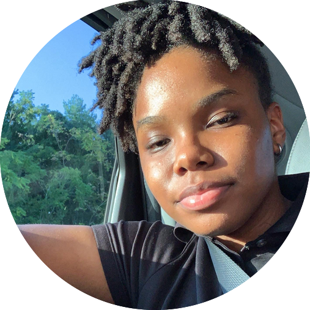
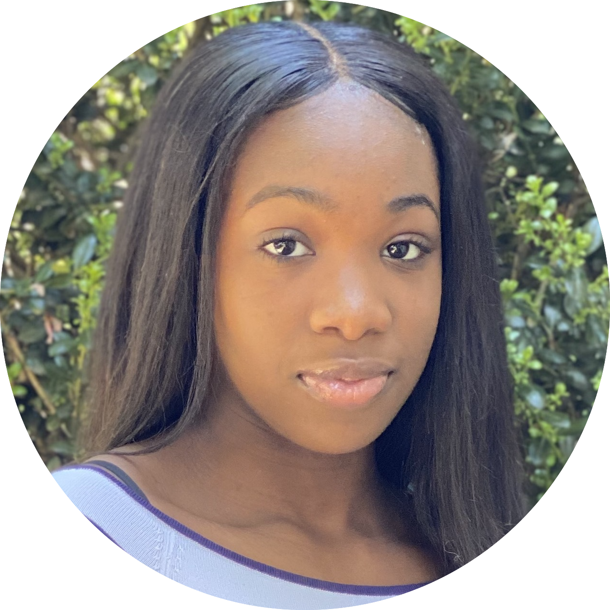

---
hide:
  - navigation 
  - toc        
---

## Faculty

<table width="600px">
	<tr>
		<th width="50%"> <h3>Dr. Kevin Moran</h3> </th>
	</tr>
	<tr>
		<td width="600px">
			&nbsp;&nbsp; 
			<ul>
				<li><b>Bio:</b> Kevin Moran is an Assistant Professor in the Department of Computer Science at George Mason University.  He graduated with his B.A. in Physics with a Computer Science Minor from the College of the Holy Cross in 2013. He graduated with his M.S. in Computer Science from William & Mary in 2015, and his Ph.D. in Computer Science from William & Mary in 2018. Dr. Moran directs the SAGE Research Lab.</li>
  				<li><a href="https://www.kpmoran.com"></a>&nbsp;&nbsp;
  				<a href="https://twitter.com/kevpmo"></a>&nbsp;&nbsp;
  				<a href="https://scholar.google.com/citations?user=CllWHUcAAAAJ&hl=en&gmla=AJsN-F78UepV0Z898WH2A0mfcnlI9zEgUSCK0ayjTjMDF7dgPL3vThX8UaBv6rYew576mmMsSow7N_8ZCVXG_vRZ3HHAoiU3Nt8MMFjR7yt78D4zLQK8GjKyO93tYocfbX54VSTN9Kac"></a>&nbsp;&nbsp;
  				<a href="https://gitlab.com/kpmoran"></a>&nbsp;&nbsp;
  				<a href="https://github.com/kpmoran"></a></li>
  			<ul>
		</td>
	</tr>
</table>

-------------------

## Ph.D. Students

	

		

			
       

       	<h3>Sabiha Salma</h3>
       	<ul>
  				<li><b>4th Year Ph.D. Student in Computer Science</b></li>
  				<li><b>Research Interests:</b> Automated UI Analysis, HCI Considerations for Developer Tools, AI for Software Engineering</li>
  				<li> <a href="https://sabiha-salma.github.io/">sabiha-salma.github.io/</a></li>
  				<li> <a href="https://twitter.com/itsmesabiha">itsmesabiha</a></li>
			</ul>

	

		

			
       

       	<h3>SM Hasan Mansur</h3>
       	<ul>
       		<li><b>4th Year Ph.D. Student in Computer Science</b></li>
  				<li><b>Research Interests:</b> Automated UI Analysis, AI for Software Engineering</li>
  				<li> <a href="http://mason.gmu.edu/~smansur4/">gmu.edu/~smansur4/</a></li>
			</ul>

	

		

			
       

       	<h3>Junayed Mahmud</h3>
       	<ul>
       		<li><b>3rd Year Ph.D. Student in Computer Science</b></li>
  				<li><b>Research Interests:</b> Bug Reporting, NLP for Software Engineering, Automated Mobile Testing </li>
  				<li> <a href="http://mason.gmu.edu/~jmahmud/">gmu.edu/~jmahmud/</a></li>
  				<li> <a href="https://twitter.com/JunayedMahmud10">JunayedMahmud10</a></li>
			</ul>

	

		

			
       

       	<h3>Safwat Ali Kahn</h3>
       	<ul>
  				<li><b>3rd Year Ph.D. Student in Computer Science</b></li>
  				<li><b>Research Interests:</b> Automated UI Analysis, Automated UI testing, Mobile Applications, Smart Home Testing</li>
  				<li> <a href="https://www.linkedin.com/in/safwat-ali-khan">LinkedIn</a></li>
  				<li> <a href="https://twitter.com/safwatknopfler">safwatknopfler</a></li>
			</ul>

	

		

			
       

		

       	<h3>Arun Krishnavajjala</h3>
       	<ul>
  				<li><b>1st Year Ph.D. Student in Computer Science</b></li>
  				<li><b>Research Interests:</b> Software Engineering for Accessibility, Automated UI Analysis</li>
  				<li> <a href="http://arunkv.com/">Webpage</a></li>
  				<li> <a href="https://twitter.com/ItsArunKV">ItsArunKV</a></li>
			</ul>

-------------------

## Undergraduate Students

	

		

			
       

       	<h3>Jasmine Obas</h3>
       	<ul>
       		<li><b>Undergraduate Student at George Mason University</b></li>
  				  				<li> <a href="https://www.linkedin.com/in/jasmine-obas-burdette/">LinkedIn</a></li>
			</ul>

<!---## High School Students--->

-------------------
## Alumni

### High School Students

	

		

			
       

       	<h3>Anish Pothireddy</h3>
       	<ul>
       		<li><b>Osbourn Park High School</b></li>
       		<li><b>Position after SAGE Lab:</b>Undergraduate at the University of Pennsylvania - Wharton School of Buisness</li>
  				  				<li> <a href="https://www.linkedin.com/in/anish-c-pothireddy/">LinkedIn</a></li>
			</ul>

	

		

			
       

       	<h3>Damilola Awofisayo</h3>
       	<ul>
  				<li><b>High School Student at Thomas Jefferson High School for Science and Technology</b></li>
  				<li><b>Position after SAGE Lab:</b>Undergraduate Student</li>
  				<li> <a href="https://damilolaawofisayo.me">Webpage</a></li>
			</ul>

### Undergraduate Students

	

		

			
       

       	<h3>Kristen Goebel</h3>
       	<ul>
  				<li><b>Undergraduate Student at Clarkson University</b></li>
  				<li><b>Position after SAGE Lab:</b> Graduate Student in Computer Science at Oregon State University</li>
  				<li> <a href="http://linkedin.com/in/kgoeb">LinkedIn</a></li>
			</ul>

